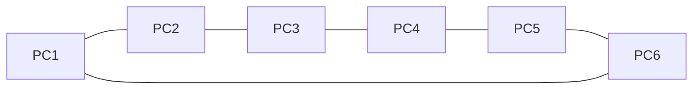

# Mininet Aula 0
## Diagrama da Rede

### 1.

### 2.
"s1 = net.addSwitch('s1', cls=OVSSwitch)"

### 3.
"h1 = net.addHost('h1')"

### 4.
"c0 = net.addController('c0', controller=RemoteController, ip='127.0.0.1', port=6633)"

